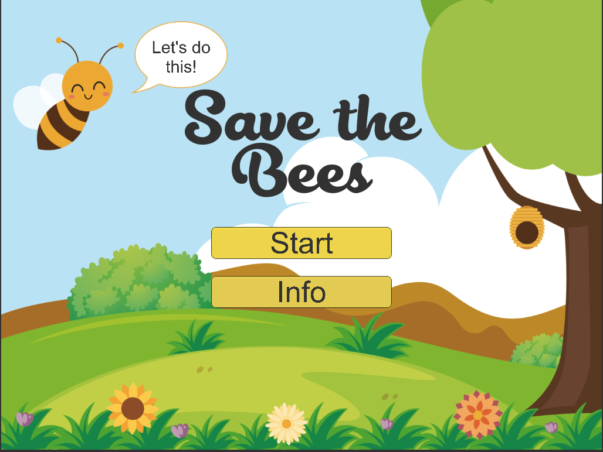
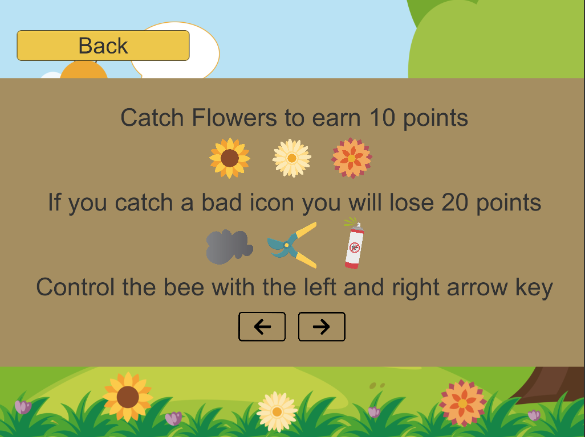
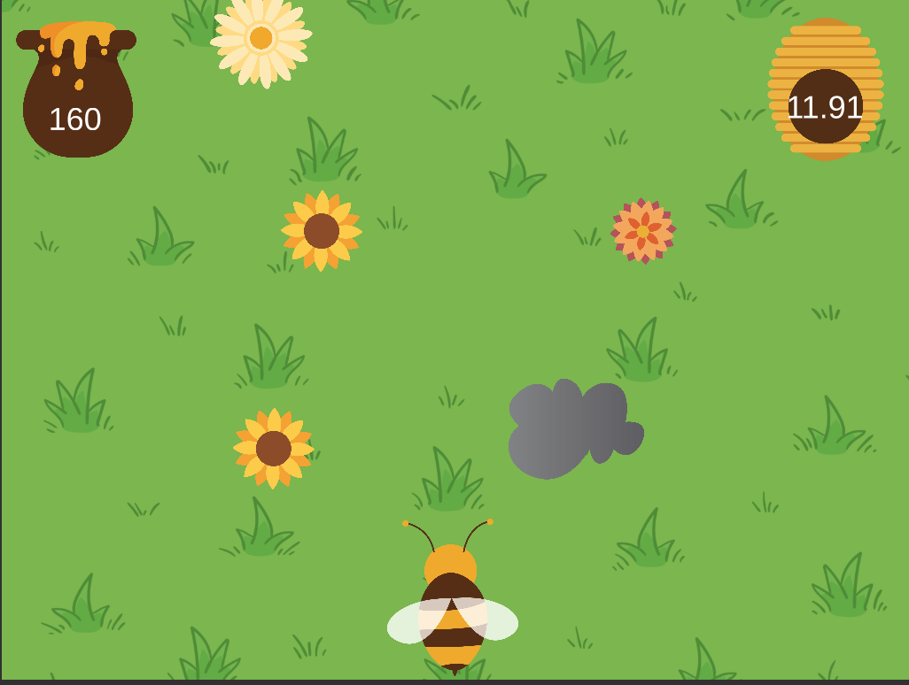
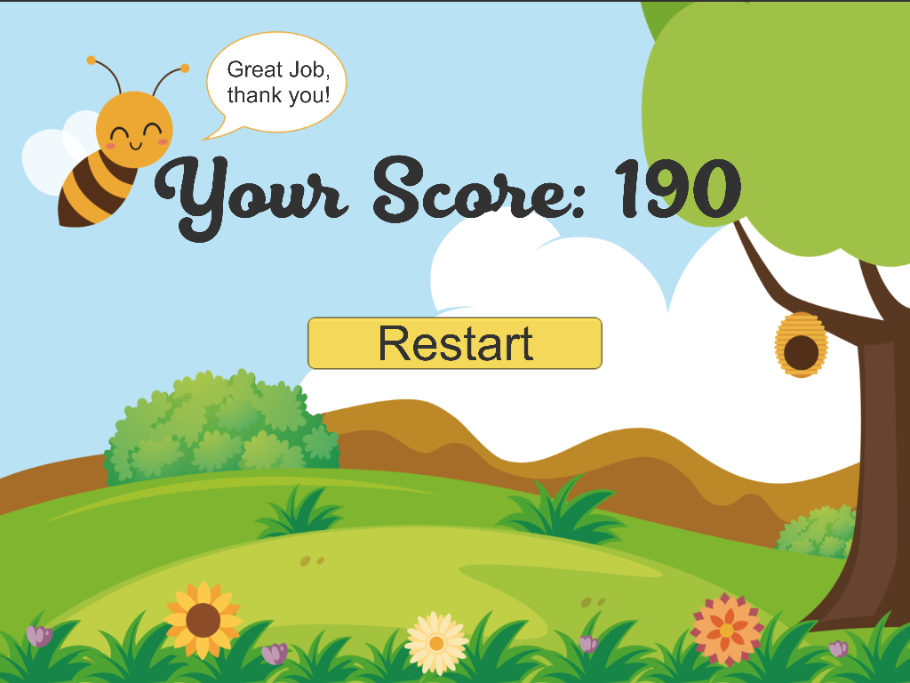

# Save the Bees
**Progress:** 80%         

#### Development Platform:       
* OS: MacOS 10.14.3       
* Unity Version 2018.2.14f1         
* Visual Studio Version 7.7.2.21
* Scripting Runtime Version: .NET 3.5 Equivalent
* API Compatibility Level: .NET 2.0 Subset
     
#### Target Platfor:     
 WebGL 1024x768

#### Game Trailer:      
https://www.youtube.com/watch?v=rtuvhSwwdjU&feature=youtu.be     

#### Description:
2D Minigame                             

Das Spiel soll Kindern von 5+ Jahren spielerisch beibringen, wie bedroht Bienen sind,
 und wie leicht man diese schädigen kann. Gleichzeitig zeigt es aber, dass man durch viel Ergeiz
 auch schnell viele Bienen retten kann. 
        
Die Start Scene zeigt den Namen des Spieles und ein paar Illustrationen,
 inmitten davon befindet sich der "Start"-Button. Wenn man diesen klickt kommt man
 von der Start Scene zur Main Scene. Unter dem "Start"-Button befindet sich ein "Info" Button,
 dieser führt den User zu einem Info Screen, wo kurz erklärt ist was man tun soll,
 und wie man die Biene steuert.        
Der Spieler steuert mit den Pfeiltasten auf der Tastatur nach links und rechts
 eine Biene die Blumen/Pollen aufsammeln soll, um Honig
 zu produzieren. Die Collectibles fallen von oben nach unten,
 somit hat der Spieler Zeit, um zur richtigen Position zu fahren. Es gibt 3 gute und 3 schlecht
 Collectibles die jeweils gespawned abwechseln dynamisch von oben nach unten fallen.
 Für jede eingesammelte Blume gibt es 10 Punkte, jedoch gibt es auch schlechte
 Items, wie zum Beispiel ein Insektenschutzmittel oder eine Abgaswolke,
 welche jeweils 20 Minuspunkte geben. Es gibt deswegen mehr Minus-
 als Pluspunkte, um den Spieler zu zeigen, dass Bienen aussterben und
 die negativen, nicht natürlichen Dinge, den positiven überwiegen.
 Man hat 60 Sekunden Zeit um so viele Blumen wie möglich zu bestäuben,
 da die Zeit, um die Bienen zu retten, leider sehr begrenzt ist.            
Entweder wird das Spiel durch das Ablaufen der 60 Sekunden beendet, oder wenn der Score
 100 Minuspunkte sind, da dann die Biene zu geschwächt ist, um weiter zu machen.
 Wenn die Zeit abgelaufen ist oder man zu geschwächt ist, wechselt man zur End Scene,
 welche den gesammelten Punktestand anzeigt.
 Danach kann man das Spiel restarten, wenn man möchte.
        
#### Controls:     
On X-Axis, with the left and right arrow key or with AD
       
#### Mockups:
* Start Screen  	  

     
* Info Screen

* Main Screen 

* End Screen

       
#### Gameplay Screenshots
     
* Start Scene

    
* Info Scene

      
* Main Scene

      
* End Scene

         
#### Lessons learned
* Concepting a game
* Basic programming in Unity
* Working with Scriptable Objects, Colliders and Rigidbodies in Unity
* Code Refactoring in C#
* Loading new Scenes with the SceneLoader Script
* How to make a Countdown
     
#### Third Party Material
* Belmonte Font by Nasir Udin
* Hand Drawn Grass Background by Freepik
* Background Scene with Green Lawn by Freepik
* Baby Logo by Freepik
* Hand Holding Mosquito Spray by Freepik       
* Royalty Free Music by Bensound "Buddy" (for the trailer)
* Sweet honey drips by freepik
      

> Copyright by Anna Hagenstein
